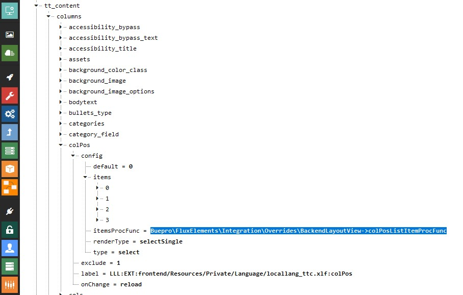

.. include:: ../Includes.txt

.. _administration:

==============
Administration
==============

.. _installation:

Installation
============

In most cases the extension just needs to be installed (through the extension manager or composer) and no further
action is required.

.. note::

   Upon installing the extension for the first time the `flux` extension configuration will be altered. Please consult
   the :ref:`extension configuration <config_extension>` for more details.

Extend templates
----------------

In case the provided templates need to be adjusted additional template paths have to be configured. For this purpose
the static template `Flux elements` can be added to the template record (`Include static (from extensions)`).

Gridelements
------------

On installations using `gridelements` and `flux_elements` it might be needed to check the TCA entry from `itemsProcFunc`
for the `colPos` field from `tt_content` in the configuration module. It should be set to:

`Buepro\FluxElements\Integration\Overrides\BackendLayoutView->colPosListItemProcFunc`

   TCA setting for itemsProcFunc
