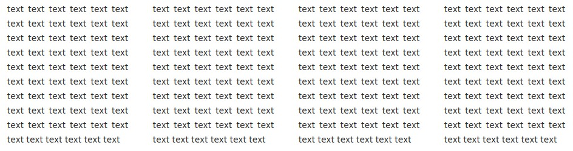
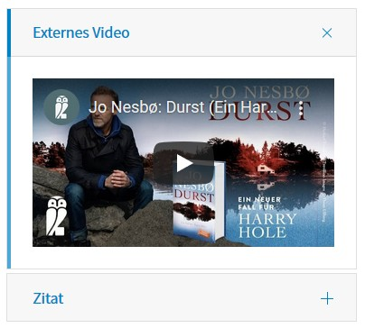

.. include:: ../Includes.txt

.. _introduction:

============
Introduction
============

This extension provides elements to further structure the content area. Currently the following elements are
available:

- Container
- Columns
- Register
- Accordion
- Tile unit

Since the elements are provided by `flux <https://extensions.typo3.org/extension/flux>`__ they are following referred
to as flux-elements.

Flux-elements can hold any kind of content elements as well as other flux-elements.

Currently flux-elements are intended to be used together with the bootstrap framework.

Examples
--------

   Columns

   Tabs

   Accordion

.. figure:: ../Images/User/TileUnit.jpg
   :width: 500px
   :alt: Tile unit

   Tile unit
