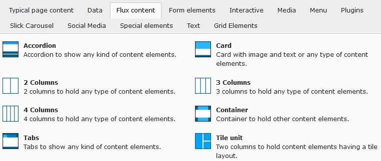
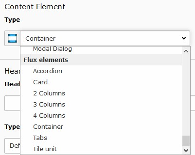

.. include:: ../Includes.txt

.. _user_use_elements:

=================
Use flux elements
=================

New content element wizard
==========================

Flux elements can be added by the new content element wizard. The available elements can be found under the register
`Flux content`.

   Flux elements are available under the Flux content tab in new content element wizard

Content element type
====================

When changing a content element type the flux elements are available under `Flux elements`.

   Flux elements in content element type selector

Vertical spacing
================

Sometimes structure elements are rendered with excessive vertical spacing. To reduce them `No frame` might be
selected by the frame selector under the `Appearance`-tab.

.. figure:: ../Images/User/FrameSelector.jpg
   :alt: Select the appropriate frame to adjust vertical spacing

   Select the appropriate frame to adjust vertical spacing
